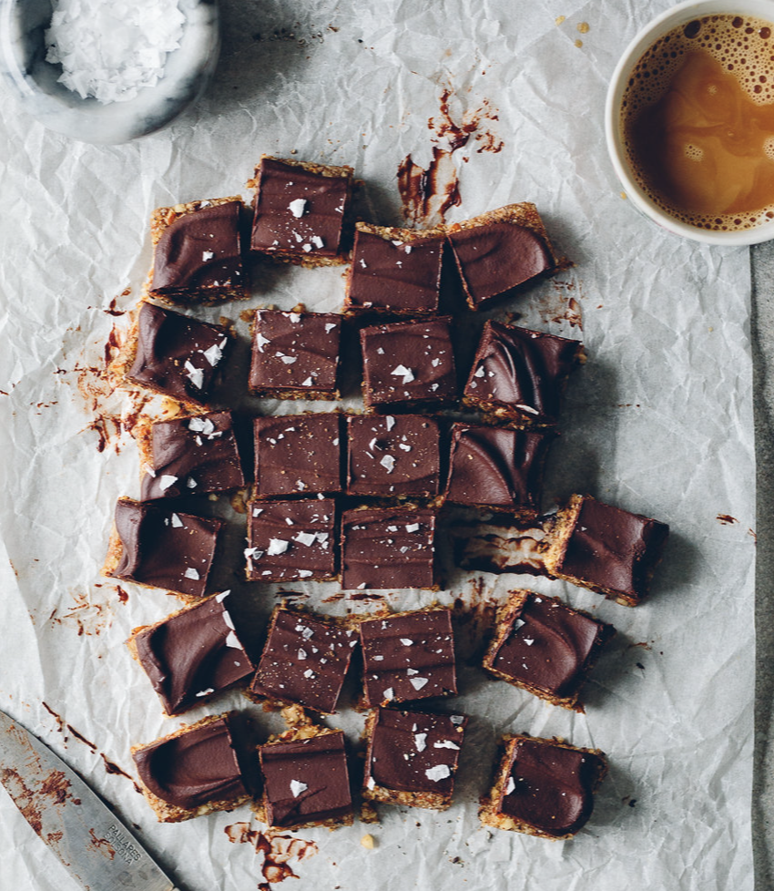

```{r setup, include=FALSE}
knitr::opts_chunk$set(echo = TRUE)
```




<!-- Add your them graphic here -->

# Introduction
Hi, I'm Ying! Do you love Chocolate? I will not be surprised if you say "YES"！ Chocolate is fantastic. It has a beautiful taste and makes people feel happy. According to Healthline, studies show that dark Chocolate can improve one's health and lower the risk of heart disease. So as Christmas is around the corner, let's look at Chocolate and find the mystery behind the fantastic sweets!

I focus on Chocolate and use the dataset called Chocolate Bar Ratings from https://www.kaggle.com/rtatman/chocolate-bar-ratings.

Following are the introduction of the dataset:
Each year, residents of the United States collectively eat more than 2.8 billion pounds. However, not all chocolate bars are created equal! This dataset contains expert ratings of over 1,700 individual chocolate bars, along with information on their regional origin, percentage of cocoa, the variety of chocolate beans used, and where the beans were grown.

About the dataset:
This dataset contains expert ratings of over 1,700 individual chocolate bars, along with information on their regional origin, percentage of cocoa, the variety of chocolate beans used, and where the beans were grown. A rating here only represents an experience with one bar from one batch and represents the overall experience of flavor, texture, and the after melt of the Chocolate.

Using this dataset, I invited you to learn more about the charming Chocolate!

## Data
In the section below, I will explain how I proceeded with this project and how I did the data cleaning.

1.Data Sources
To find out the answers, I import data Chocolate Bar Ratings(https://www.kaggle.com/rtatman/chocolate-bar-ratings), all the data is downloaded directed from the website, not pre-clean with the data. Everything was done in R as you can see in later steps.

2.Data Cleaning
In order to do the analysis, I firstly load the libraries and proceed with checking the data.
```{r}
#require(tm)
require(tidyverse)
require(lubridate)
require(skimr)
require(kableExtra)
require(ggplot2)
require(RColorBrewer)
library(here)
library(tidyverse)
library(anytime)
library(gridExtra)
require(ggplot2)
library(grid)
library(gridExtra)
library(kableExtra)
library(wordcloud)
library(corrplot)
#library(tm)

```

# Research question
There are lots of interesting things to be found for this dataset.

My personal interests are...

* Which companies produce good chocolate ( want to buy some for the Christmas!) ?

* What is the average rate of the chocolate?

* Where are good chocolates comes from?

* What is the relationship between cocoa percentage and the quality of chocolate?

* Can we predict the rating of a chocolate?


Import the dataset and see its structure.
```{r}
ChocolateData <- read.csv("../data/flavors_of_cacao.csv") 
str(ChocolateData) 
summary(ChocolateData) 
head(ChocolateData, 10)
```

Now we have the dataframe, We have 1795 observations and 9 variables. 
but I don't like the way how it looks.

I want to change...

* Change the colnames to be more readable

* Change the properer data type

* Deal with missing value

* Delete "REF", I will not use this variable


```{r}
colnames(ChocolateData) <- c("Company", "BarOrigin", "REF", "ReviewDate", "CocoaPct", "Loc", "Rating", "Type", "BeanOrigin")
ChocolateData$CocoaPct <- gsub("[%]", "", ChocolateData$CocoaPct)
ChocolateData$CocoaPct <- as.numeric(ChocolateData$CocoaPct)
ChocolateData[, c(8,9)] <- sapply(ChocolateData[,c(8,9)], str_trim)
is.na(ChocolateData) <- ChocolateData==''
ChocolateData <- ChocolateData[, -3]

str(ChocolateData)
head(ChocolateData, 10)
```

Cool, I like how it looks now.

Now we have 8 variables. Let’s look at distributions of these variables. I will plot the categorical variables as bar charts, showing the most popular values and see what we could find.

```{r}
#top companies
Top_companies <- ChocolateData %>%
  group_by(Company) %>% 
  summarise(Count= n())%>%
  top_n(10, wt = Count) %>%
  arrange(desc(Count))

ggplot(Top_companies, aes(reorder(Company, Count),  Count, fill = Count)) + 
  coord_flip() +
  geom_bar(stat = "identity", size = 0.1)+xlab("Top_Companies")

#Review_cocoa_date
Review_cocoa <- ChocolateData %>%
  group_by(ReviewDate) %>% 
  summarise(Count= n())

  ggplot(Review_cocoa, aes(x =factor(ReviewDate), y = Count, fill = Count)) + 
  geom_bar(stat = "identity", size = 0.1) +
  xlab("Review Date") +
  coord_flip()
  
  
#BarOrigin
BarOrigin_new <- ChocolateData %>%
  group_by(BarOrigin) %>% 
  summarise(Count= n()) %>% 
  top_n(10, wt = Count) %>%
  arrange(desc(Count))

  ggplot(BarOrigin_new, aes(reorder(BarOrigin, Count),  Count, fill = Count)) + 
  coord_flip() +
  geom_bar(stat = "identity", size = 0.1) + xlab("Top_BarOrigin")
  
#BeanTypes
  BeanTypes <- ChocolateData %>%
   group_by(Type) %>% 
   na.omit() %>%
   summarise(Count= n()) %>% 
   mutate(pct=Count/sum(Count)) %>% 
   top_n(10, wt = pct)
  
   ggplot(BeanTypes, aes(x =reorder(Type,pct), y =pct, fill = pct)) + 
   geom_bar(stat = "identity", size = 0.1) + 
   coord_flip() +
   xlab("Bean_Type") +ylab("Percentage")
   

```
So we can find...

* The top 3 Companies are Soma, Bonnat, Fresco
* The top 3 ReviewDate are 2015, 2014, 2016 (What happened in 2015?)
* The top 3 BarOrigin are Magascar, Peru, Ecuador
* The top 3 type is Trinitario, Ciollo, Forastero (I omit all NA)

After finishing these chart, I have a basic understanding about the data, now I will go to my questions and try to find answers.

# Which companies produce good chocolate

For my first question: Which companies produce good chocolate(want to buy some for Christmas!)?

```{r}
Company_rating <- ChocolateData %>%
  group_by(Company) %>%
  summarize(rating = mean(Rating), count = n()) %>%
  arrange(desc(count),desc(rating));

head(Company_rating, n = 10)

Companies <- ChocolateData %>%
  group_by(Company) %>% 
  filter(n() > 10) %>% 
  mutate(avg = mean(Rating))

Companies  %>%
  ggplot(aes(x = reorder(as.factor(Company), Rating, FUN = mean), y = Rating)) + 
  geom_point(aes(x = as.factor(Company), y = avg, colour = avg)) + 
  geom_count(alpha = .1) + 
  coord_flip() + 
  labs(x = "Company", y = "Rating") 

```


Take review times and average rating into consideration, Soma is NO.1. Amedel is excellent, but the sample size is rather small.
Therefore, I think the most easy to buy Chocolate with high quality is more likely to be found in Soma.
Let's buy Soma!

# What is the average rate of the chocolate?
After find our the company, I want to understand the average performance of chocolate rating.
So I draw a bar chart to find the distribution.


```{r}
ggplot(ChocolateData, aes(factor(Rating))) + 
  geom_bar(fill = "steelblue") + 
  xlab("Rating") 

summary(ChocolateData$Rating)
```
Flavors of Cacao Rating System:
5= Elite (Transcending beyond the ordinary limits)
4= Premium (Superior flavor development, character and style)
3= Satisfactory(3.0) to praiseworthy(3.75) (well made with special qualities)
2= Disappointing (Passable but contains at least one significant flaw)
1= Unpleasant (mostly unpalatable)

Most of the rates are between 2.75-3.75, I'm happy to see we have most rating lie around 3.5, which is Satisfactory! This makes me feel more confident about buy chocolate randomly from any company without worrying too much about its flavor.
Also, mean of the rating are 3.186, median is 3.25, we find the answer of what is the average rate of chocolate.

However, the number is not straightforward, I want to make it readable by adding notes to it.
First, rearrange ratings to 5 groups.

```{r}
Rating_Pct_Com <- data.frame(RatingLev = c("Unpleasant","Disappointing","Satisfactory-Praiseworthy","Premium","Elite"),
 Rating = c("1 <= Rating < 2", "2 <= Rating < 3", "3 <= Rating <= 3.75", "3.75 < Rating <= 5", "Rating = 5"), 
 Note =  c("Elite (Transcending beyond the ordinary limits)",
    "Premium (Superior flavor development, character and style)",
    "Satisfactory(3.0) to praiseworthy(3.75) (well made with special qualities)",
    "Disappointing (Passable but contains at least one significant flaw)",
    "Unpleasant (mostly unpalatable)"))

kbl(Rating_Pct_Com, caption = "Chocolate Rating Description") %>%
kable_classic(html="Cambria", full_width=FALSE)

```

#Where are good chocolates comes from?
Next, I want to find out where are good Chocolate come from? 
First, I create a wordcloud for the company loaction because I always like word cloud and it is really cool!
Then, I draw a boxplot to see the relationship between company location and rating.

```{r}
word_choc <- gsub(" ", "",ChocolateData$Loc)
wordcloud(word_choc, max.words = 200, random.order = FALSE, scale = c(4,0.7), rot.per = 0.5, colors = brewer.pal(8, "Dark2"))
```
This is cool, we know the Top countries in a visual way.
Do these countries have the best chocolates? I want to create a boxplot to see the distributions about countries and ratings.I decide to display those countries that have been rated for more than 5 times.

```{r}
ChocolateData %>%
  group_by(Loc) %>% 
  filter(n() > 5) %>% 
  mutate(avg = mean(Rating)) %>%
  ggplot() + 
  geom_boxplot(aes(reorder(Loc, avg), Rating, fill = avg)) + 
  scale_fill_continuous(low = "#132B43", high = "#56B1F7", name = "Average rating") + 
  coord_flip() + 
  labs(x = "Company Location", y = "Rating") 

summary(ChocolateData$Rating)
```

So we can tell that the good chocolate come for Australia, Switzerland, Italy and Canada.

# What is the relationship between cocoa percentage and the quality of chocolate?

Cocoa percent
Let’s investigate to see whether there is a relationship between cocoa percentage and the chocolate’s rating.
My assumption : the higher the cocoa percentage, the more bitter the chocolate tastes. 

```{r}
ChocolateData%>%
  ggplot(aes(x = Rating, y = CocoaPct)) +
  geom_point() +
  labs(x = "Rating", y ="Cocoa percentage" ) + 
  geom_smooth(method = "lm", se = FALSE, col = "brown")

```
From the chart, I would like to see there is not very strong linear relationship between cocoa percentage and chocolate rating.
So I try to go deeper.

```{r}
model_1 <- lm(formula = Rating ~ CocoaPct, data = ChocolateData)

summary(model_1)
```
As we can see, the adjusted R-squared of 0.02662 and the p-value is 2.122e-12. lm is not a good model to measure the relationship between
cocoa percentage and chocolate rating. But the negative slope as well as the chart implies that the higher the cocoa percent, the lower the rating of chocolate could be, which is the opposite to my assumption.

# Can we predict the rating of a chocolate?
If we want to find a model to help with predicting the rating of the chocolate, we need to go back to the main dataset and add more variables into consideration.

```{r}
chocolate_cor <- data.frame(ChocolateData$ReviewDate, ChocolateData$CocoaPct, ChocolateData$Rating)
names(chocolate_cor)[1:3] <- c("Review Date", "Cocoa Percent", "Rating")

chocolate_cor <- round(cor(chocolate_cor), 3)

chocolate_cor %>%
  kbl(caption = "The relationship between Rating, Review date and Cocoa Percent", digits= 3) %>% 
  kable_classic( html="Cambria", full_width=FALSE)

```


```{r}
Relations <- corrplot(chocolate_cor, method = 'circle', type = 'upper', tl.srt = 30)

```

We can see from the chart that there is no strong connections between these variables, slightly negative connection between rating and cocoa percents. Very slightly positive connection between Review Date and Rating.

# Conclusion

### Which companies produce good chocolate(want to buy some for the Christmas!)?
Buy Soma!

### What is the average rate of the chocolate?
Pretty good!Most of the rates are between 2.75-3.75, mean of the rating are 3.186, median is 3.25.

### Where are good chocolates comes from?
In general, Canada and Italy are better choices, even though USA ranking first in company distribution, they do not produce the highest rating chocolate.

### What is the relationship between cocoa percentage and the quality of chocolate?
It is hard to say that there are some relationship between these two variables.
Maybe slightly negative. I guess it is because the more cocoa percentage it is , the bitter the chocolate will be. And most people like sweet taste.Choosing 70%-75% cocoa percentage is most likely to buy awesome chocolate.

### Can we predict the rating of a chocolate?
From my analysis, it is hard to say there are any factors that help with predicting the rating of chocolate.
It is likely to buy higher chocolate if you choose to buy 70%-75% cocoa percentage. It would be better if the companies were from Australia, Switzerland, Italy, and Canada. To make things easier, buy Soma.

Furthermore, I think cocoa's type and bar origin will play an important role in rating chocolate. I will go deeper and use these variables to find the relationship if I have a chance.

Thanks for going through the Chocolate review journey with me!
Nevertheless, there are limitations to this simple research. I don't really go deeper but use some common variables to describe the relationship. The latest data is from 2017, which is about four years ago. How is the situation now? Will Covid influence the transport of cocoa, therefore influent the produce of chocolate? I have no answers to this question. I hope I will be able to answer them someday by continuing my study.

# Bibliography
1.Photo, https://www.pinterest.com/pin/586734657714494204

2.Healthline."7 Proven Health Benefits of Dark Chocolate" https://www.healthline.com/nutrition/7-health-benefits-dark-chocolate?epik=dj0yJnU9bXYyeWVSd3ZMb0dFQjg4ZXg3ZGl0QjRWdU9YLWM5ZWkmcD0wJm49NEpQM3lVWmNtQ2kzY1lMNDdfYkUwQSZ0PUFBQUFBR0d0amU4#TOC_TITLE_HDR_9

3.Jason Horn,"What Is the Difference Between Bittersweet and Semisweet Chocolate?"
https://greatist.com/eat/what-is-the-difference-between-bittersweet-chocolate-and-semisweet-chocolate

4.Coffee Quality database from CQI, https://www.kaggle.com/volpatto/coffee-quality-database-from-cqi

5.Chocolate Bar Ratings, https://www.kaggle.com/rtatman/chocolate-bar-ratings
Note: I can a lot of inspiration from NO.4 &NO.5, after my finish the 1st version of my code, I made some adjustments based on some codes and logic, I truly appreciate it but all the codes of my final version are created by myself.

Cheers!


